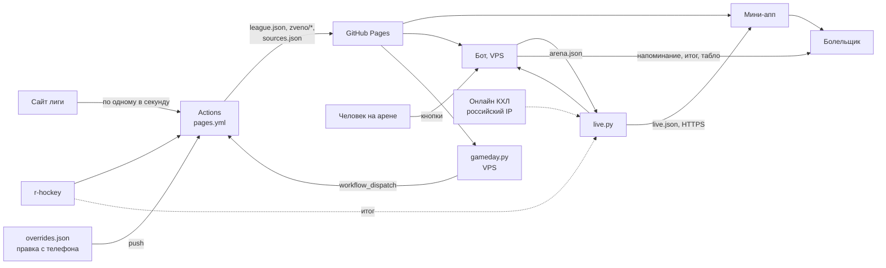

# ADR-015. Игровой день: сбор данных, доставка обновлений и лайв

Статус: предложено, 28.09.2026 — запрос владельца продукта: как собирать информацию, как доставлять
обновления и как вести лайв матчей. Опирается на ADR-012 и не заменяет его: закрывает открытые
места и раскладывает работу к первому игровому дню, 03.10. Поправки к ADR-012 — отдельным
разделом. Разведка — `docs/research/2026-09-28-sources-before-season.md`.

## Контекст

ADR-012 решил, что показывать (стадия, статус, три слоя статистики) и в каком порядке верить
источникам. Открытыми остались три вещи: когда и по какому сигналу собирать данные, как изменения
доходят до болельщика и что делать с лайвом, пока нет ни VPS, ни онлайна КХЛ.

Что выяснилось 28.09, за пять дней до старта:

1. **Сайт РХЛ закрыт.** `rhl.fhr.ru` — 401 «Under construction». Протоколов, лидеров, составов,
   официального времени начала и номеров `idgame` нет. На `nmhl.fhr.ru` турнира 2026/27 тоже нет
2. **Времени начала нет ни в одном разрешённом источнике**: ни в `games.json`, ни в `calendar.pdf`,
   ни у r-hockey — ни в календаре, ни на странице матча
3. **«Раз в час» — неправда.** Задание Pages по `cron: "17 * * * *"` за 81 час запустилось 19 раз:
   раз в 2,6–6,4 часа, медиана 4,7. На часовом ритме стоят итог в боте (ADR-008), лидеры
   (ADR-009) и «Звено» (ADR-014)
4. **Бот не работает постоянно.** VPS нет, `run-bot.yml` — стенд на несколько часов, подписчики
   на нём не сохраняются. Без хоста не будет ни напоминания 02.10 в 19:00, ни итогов, ни кнопок с
   арены
5. **Онлайн КХЛ закрыт блоком по IP, а не только для заграницы.** Страница 403: «Обнаружена
   потенциальная вредоносная активность с вашего IP-адреса… направить на access_deny@khl.ru
   информацию о вашем внешнем IP». IP дата-центра может оказаться закрыт и в России. Законный
   путь — письмо с IP нашего сервера
6. **Конвейер хрупкий и расточительный:**
   - упал r-hockey — падает вся сборка, мини-апп не обновляется (`build_data.main` без запасного
     пути);
   - каждый прогон заново качает все протоколы за три дня и семь страниц лидеров — при честном
     часовом ритме это около 1 000 запросов к лиге в сутки;
   - `parse_game_ids` берёт любую ссылку на протокол. Если у будущих матчей на новом сайте она
     есть, первый прогон запросит весь сезон

## Решение

### 1. Три контура

| Контур | Где | Что делает | Если упал |
| --- | --- | --- | --- |
| Официальный | GitHub Actions, `pages.yml` | Единственный, кто ходит на сайт лиги. Календарь, протоколы, лидеры, составы, r-hockey → `league.json`, разборы, `zveno/*`, `sources.json` → Pages | Мини-апп показывает последнее собранное; живой контур работает |
| Часы и доставка | Любой VPS: бот, `gameday.py`, сервер «Звена» | Будит официальный контур в нужные минуты, напоминает, присылает итог, принимает кнопки с арены, сторожит свежесть | Actions идёт по запасному cron, реже. Нет напоминаний и лайва |
| Живой | `live.py` на VPS. Адаптеры онлайна КХЛ и Фонбета — только с российского IP | Статус и счёт по ходу → `live.json` по HTTPS | Счёт после матча, как без лайва |

Контуры связаны только опубликованными файлами: `league.json` на Pages и `live.json` на VPS. Поэтому
бот, `live.py` и сервер «Звена» не обязаны жить на одной машине.

Главная перемена против ADR-012: **официальный контур запускается по событиям, а не по часам.**
`gameday.py` знает, когда матчи должны закончиться, и запускает `pages.yml` через
`workflow_dispatch`. Cron остаётся запасным.



### 2. Карта потоков

Старшинство источников — ADR-012, пункт 2. Здесь — кто качает и когда.

| Поток | Источники по старшинству | Кто | Тихий день | Игровой день | Как узнаём новое |
| --- | --- | --- | --- | --- | --- |
| Календарь, номера `n` и `idgame` | Лига → `games.json` («Рязань») → r-hockey → `overrides.json` | Actions | Утром и ночью | Каждый прогон | Строка календаря лиги |
| Время начала | Лига (календарь, протокол) → `overrides.json` | Actions | Утром | Утром | Поле строки; ручная правка — push |
| Перенос, отмена | Лига → `overrides.json` | Actions | Утром | Каждый прогон | Дата матча с номером `n` отличается от базовой |
| Предварительный итог | Живой источник → r-hockey | VPS (`live.py`), Actions | — | Окно после матча | Счёт в строке r-hockey |
| Протокол | Лига | Actions | — | Окно после матча | В календаре лиги у матча счёт, а протокола у нас нет |
| Правки протоколов | Лига | Actions | Ночная сверка | Ночная сверка | Повторный запрос за 3 дня (`SETTLE_DAYS`) |
| Лидеры (ADR-009) | Лига | Actions | Ночью | После прогона с новым протоколом, не чаще раза в час | — |
| Составы (ADR-007) | Лига | Actions | Все 26 — в ночь на понедельник | Клубы с новым протоколом | — |
| Предсезонка | r-hockey `premhl` | Actions | Раз в сутки, в августе–сентябре | — | — |
| Живое состояние | Онлайн КХЛ → Фонбет → арена | VPS, `live.py` | — | За 15 минут до начала — до протокола | Каждый опрос |
| Открытие сайта РХЛ | `rhl.fhr.ru` | Actions | Один запрос в прогон | То же | Ответ не 401 → тревога владельцу |

### 3. Ключи и детект изменений

1. **Строка календаря лиги — детектор изменений.** Из неё берём номер `n`, `idgame`, дату, команды
   и счёт. Протокол запрашиваем, только если в строке есть счёт, а протокола у нас нет или счёт в
   строке другой. Строка без счёта не даёт запроса, даже если в ней есть ссылка на протокол
2. **`idgame` — ключ связи с внешним миром**: протокол, онлайн КХЛ, `ids.json` (ADR-012, пункт 2).
   **Id матча в мини-аппе** — `n<номер>` для регулярки. У «Рязани» так уже сейчас (`n1`), остальные
   переходят с `rh<id r-hockey>` на `n<номер>`, когда появится календарь лиги. Старый id — в поле
   `was`, ссылки `?match=rh…` продолжают открываться. Плей-офф — `po<номер>`: там у лиги своя
   нумерация (ADR-001)
3. **Перенос** — у лиги дата матча с номером `n` не та, что в базе. База «Рязани» — `games.json`,
   остальных — `calendar_base.json`: первый снимок календаря лиги, кладётся в git руками один раз,
   как `history.json`. Формат `games.json` не меняется
4. **Ручная правка — `overrides.json` в git**: время, перенос или отмена по id матча, с полем
   «откуда» («клуб», «лига»). Это правка данных, а не кода: владелец коммитит её в `main` прямо в
   веб-интерфейсе GitHub с телефона, как `hidden_players.json`. Push запускает сборку сразу, без
   опозданий cron
5. **Идемпотентность:**
   - прогон с теми же ответами сайтов даёт те же файлы;
   - `results.json` — по турниру и номеру матча, с перезаписью;
   - параллельных прогонов нет (`concurrency: pages`), лишние запуски схлопываются в один
     ожидающий;
   - бот помнит отправленное: `announced.json` (итоги, ADR-008) и `reminded.json` (напоминания по
     ключу `n1:tomorrow`), чтобы перезапуск в 19:00 не прислал дважды
6. **Первое появление.** У матча в `league.json` поле `seen`: когда итог впервые показали r-hockey,
   календарь лиги и протокол. Из него строка «откуда и когда» в карточке и ответ на открытый
   вопрос 3 из `docs/ARCHITECTURE.md` — через сколько лига публикует счёт

### 4. Источник сломался или сменил вёрстку

1. **Пустой разбор не затирает хорошие данные.** Ноль строк там, где вчера была сотня, — оставляем
   прошлое, как уже делает `update_leaders`. Календарь, где меньше 90% матчей прошлого снимка, не
   принимаем
2. **У каждого источника — последний удачный снимок.** Упал r-hockey — календарь из кэша Actions,
   сборка идёт дальше
3. **`sources.json`** (ADR-012, пункт 7.6) пишет Actions: у каждого источника время последнего
   удачного ответа, последней ошибки и её причина
4. **Тревоги владельцу — уже без VPS.** Задание Actions само пишет в Telegram через Bot API: тот же
   секрет `BOT_TOKEN`, переменная `OWNER_ID`. Причины:
   - шаг упал;
   - протокол не привязался к матчу;
   - разбор пустой;
   - счёт в протоколе не совпал со строкой календаря;
   - `rhl.fhr.ru` перестал отвечать 401.

   Не чаще раза на причину за прогон. С VPS тревоги о свежести добавляет `gameday.py`
5. **Канарейка** (ADR-012, пункт 7.8) — в ночной сверке: по одной известной странице лиги и
   r-hockey, разбор сравнивается с ожидаемым
6. **Новая вёрстка — новая фикстура.** Страницу, на которой разбор сломался, сохраняем в
   `tests/fixtures/`, чиним разбор, тест держит. Как с `nmhl.fhr.ru` (ADR-001)

### 5. Расписание: тихий день и игровой

Время — московское. Игровой день — в `league.json` есть матч сегодня у любого из 26 клубов.

| Триггер | Когда | Режим | Запросов к лиге |
| --- | --- | --- | --- |
| Утренний | 08:40, каждый день — до напоминания в 10:00 | `fresh` + r-hockey на весь сезон | 2 |
| Окно после матча | Плановый конец (начало + 2:15) + 15, 30, 45, 60, 90, 120, 180 минут, пока нет протокола. Время неизвестно — с 10:00 до 24:00 каждые 45 минут | `fresh` | 2 + новые протоколы |
| Финал по живому источнику | Сразу, дальше — по окну | `fresh` | То же |
| Дедлайн «Звена» | Пн 09:05 и исключения ADR-014 | `fresh` | 2 |
| Ночная сверка | 04:40 | `settle` | 2 + протоколы за 3 дня + 6 + составы |
| Правка руками | Push в `main` | `fresh` | 2 |
| Запасной cron | :17 и :47 каждый час. По факту — раз в несколько часов | `fresh` | 2 |

- **`fresh`**: список турниров и календарь турнира. Протоколы — только новые. Лидеры — если
  прогон добавил протокол, а прошлые скачаны больше часа назад. Составы — клубов с новым протоколом
- **`settle`**: всё за `SETTLE_DAYS`, как сейчас в каждом прогоне; лидеры; канарейка. В четверг
  ночная сверка проходит до закрытия тура «Звена» в 12:00
- **Кто будит**: `gameday.py` на VPS — `workflow_dispatch` с `mode`, не чаще раза в 15 минут.
  Без VPS — запасной cron и кнопка «Run workflow» у владельца
- **Бюджет вежливости**: игровой день с 13 матчами — порядка 150–200 запросов к лиге за сутки,
  тихий день — 40–50. Сейчас при честном часовом ритме было бы около 1 000. Всё — по одному, с паузой в
  секунду, из одного места
- **Ограничения Actions**: cron не чаще раза в 5 минут и опаздывает или пропадает; запланированные
  задания в публичном репозитории выключаются после 60 дней без активности. Сторож свежести
  (пункт 6) это заметит

### 6. Доставка

**Мини-апп.**
- `league.json` и остальные файлы — с Pages. Кэш Pages — 10 минут. От протокола у лиги до экрана:
  до 15 минут до ближайшего прогона в первый час после матча (дальше — до 30–60), минута сборки и
  до 10 минут кэша. Цель — полчаса. Сейчас — до 6 часов
- Мини-апп перечитывает `league.json`, когда болельщик возвращается на экран, если файлу больше 10
  минут. Сейчас файл читается один раз при открытии
- `live.json` с VPS — как в ADR-012, пункт 5: раз в 20 секунд и только пока в лиге есть матч в
  `soon`, `live`, `break` или `ended`, а экран открыт
- Что показывать у матча, по порядку: протокол → свежее живое → предварительный итог → статус по
  времени (пункт 7). Пришёл протокол — живое и предварительное для этого матча не показываются

**Бот.**
- **Напоминания** — в те же 19:00 и 10:00. Дату, время и статус бот берёт из опубликованного
  `league.json`: перенесённый матч напоминается в новый день, об отменённом не напоминаем. Не
  скачался `league.json` — как сейчас, по `games.json`. В тексте — время начала, если оно известно
  (ADR-012, пункт 9)
- **Итог** (ADR-008) — по протоколу, как сейчас, или раньше: когда два разных источника итога
  согласны — живой, арена или r-hockey (поправка к ADR-012, пункт 7.4). Без протокола кнопка «Как
  это было» открывает карточку со счётом и «ждём протокол», сюжета в сообщении нет. Протокол потом
  разошёлся со счётом — тревога владельцу, болельщикам повторно не пишем
- **Сторож свежести**: окно после матча открыто, а `league.json` старше 90 минут или запуск
  `workflow_dispatch` вернул ошибку — тревога владельцу
- Тихие часы ADR-008, 23:00–09:00, — без изменений

**«Звено».**
- Сервер и мини-апп берут опубликованные `zveno/*.json` (ADR-014, пункт 13). Свежесть — та же,
  что у `league.json`
- Дедлайн считается по часам сервера и от сборки не зависит. Прогон в пн 09:05 нужен, чтобы
  `tours.json` показал новый тур
- Правки лиги за три дня забирает ночная сверка в четверг, до закрытия тура в 12:00
- Живое и предварительное никогда не идут в очки и стоимость (ADR-014, «Чего не делаем»). В
  «Звене» у такого матча точка «ждём протокол»

### 7. Лайв

**Без VPS — статус по времени.** Поправка к таблице статусов ADR-012, пункт 1:

| Статус | Когда | Что видит болельщик |
| --- | --- | --- |
| `sched`, `soon` | Как в ADR-012 | Как в ADR-012 |
| `wait` — новый | Начало прошло, живого источника нет, итога нет | «Начало было в 16:00 · счёт после матча». Не «идёт»: без источника не выдумываем |
| `ended` | Итог по живому источнику **или по r-hockey**, протокола нет | Счёт и «предварительно · ждём протокол» |

Время начала неизвестно — статусов по времени нет, только дата, как сейчас.

**Предварительный итог из r-hockey.** У r-hockey счёт появляется в строке календаря в день игры.
Сборка кладёт его в поле `prelim` матча, а не в `score`. Матч r-hockey ложится на наш только по
дате и обеим командам; сомнение — пропуск и тревога. Это третье исключение из правила «агрегаторы
только для сверки» — после календаря (ADR-002) и предсезонки (ADR-012) — и только до протокола.

**Человек на арене — запасной путь, который может понадобиться уже 03.10.** Нужны бот на VPS и
один доверенный человек на матче. Домен не обязателен: без HTTPS счёт видно в боте, с HTTPS — и в
мини-аппе.

1. **Кто.** Доверенные люди по клубам. Список — `reporters.json` на VPS, не в git: Telegram id и
   клуб. Добавляет владелец командой `/arena add`, убирает `/arena remove`, человек сам —
   `/arena off`. Имени ведущего болельщик не видит
2. **Как начинается.** За 30 минут до начала бот спрашивает ведущих клуба хозяев: «Ведёшь
   «Рязань-ВДВ» — «Белгород», 16:00?» [Веду] [Не в этот раз]. Первый «Веду» получает матч,
   остальные видят пульт только для чтения
3. **Что жмёт.** Одно сообщение-пульт, бот его правит. Сверху состояние, под ним кнопки:

   ```
   «Рязань-ВДВ» — «Белгород» · 2-й период · 2:1
   Последнее: гол «Рязань-ВДВ», 17:42
   [Гол «Рязань-ВДВ»] [Гол «Белгород»]
   [Перерыв]
   [↩ Отменить последнее]
   [Финал]
   ```

   Кнопки меняются по ходу: до начала — [Начали]; в перерыве — [Начали 3-й]; после 3-го периода при
   ничьей — [Овертайм], после овертайма — [Буллиты]. «Финал» при ничьей не даётся. Минут матча,
   авторов и удалений нет: с трибуны их надёжно не ввести, а фамилии — только из протокола
4. **Защита от ошибок.** В каждой кнопке — номер версии состояния. Нажатие по старой версии
   (двойной тап, повтор при плохой связи) счёт не меняет: «Уже 2:1, смотри сообщение». «Отменить
   последнее» — на любое действие. «Финал» — с подтверждением: «Финал 3:2?»
5. **Свежесть.** Источник событийный: 20 минут без гола — норма. Живым считаем 40 минут от
   последнего нажатия, дальше — «идёт матч · 2:1 · обновлено 45 мин назад». 30 минут тишины в
   периоде — бот спрашивает ведущего: «Всё ещё 2-й период, 2:1?» [Да]
6. **Куда идёт.** Бот пишет `arena.json` — состояние и журнал нажатий. `live.py` читает его как
   ещё один адаптер (ADR-012, пункт 5) и публикует в `live.json` с `src: "arena"`. В карточке
   матча — «Счёт с арены · 3 мин назад»
7. **Старшинство** — последнее (ADR-012, пункт 2). Есть онлайн КХЛ — арена идёт на сверку. Пришёл
   протокол — живое этого матча убирается
8. **Итог в бот.** Одна арена — это `ended` в мини-аппе. Сообщение ждёт второго источника
   (r-hockey) или протокола
9. **Персональные данные.** В журнале нажатий — id ведущего. Через 7 дней после протокола id
   стирается, остаются время и действие. `/arena off` убирает человека из списка (правило 4
   `CLAUDE.md`)

**Табло в боте по кнопке** — решение по ADR-012, пункт 9.2, на согласие владельца. В напоминании
«Сегодня игра» — кнопка «Следить за счётом». Кто нажал, получает одно сообщение в начале матча,
дальше бот его правит, а правка не звенит. Итог — обычным сообщением ADR-008. У остальных ничего
не меняется.

**Онлайн КХЛ и Фонбет** — как в ADR-012, пункты 5–6, после российского IP. Уточнение: 403 у КХЛ —
блок по IP с адресом для обращения. Первый шаг с нового сервера — письмо на access_deny@khl.ru с его
IP и описанием проекта. Вместе с ним — вопрос лиге из ADR-012 (открытый вопрос 3).

**Живой слой — без фамилий.** Пока не проверено, что id игроков в онлайне совпадают с id лиги,
`hidden_players.json` к ним не применить (ADR-008, пункт 6). Поэтому голы в `live.json` — команда,
период и время. Фамилии — только из протокола.

**Живое никогда не попадает в официальное.**
- `live.json` живёт на VPS. `league.py`, `build_data.py` и `build_zveno.py` его не читают
- Предварительный итог — в `prelim`. Таблица, очные встречи, лидеры и «Звено» читают только
  `score` и `results.json`
- Тест: матч с `prelim` без `score` не меняет таблицу, очные встречи и данные «Звена»

### 8. Регламент игрового дня для владельца

Пока нет VPS:
- **Накануне до 18:00** — время начала завтрашних матчей в `overrides.json`, если лига его не
  публикует. Источник — клуб или лига, поле «откуда» заполнить
- **Вечером** — мини-апп не обновился через 30 минут после конца матча: Actions → «Мини-апп» →
  Run workflow
- **Тревога «сайт РХЛ открылся»** — разработка прогоняет разбор на его протоколе и календаре
  (ADR-001), потом владелец задаёт `LEAGUE_SITE=https://rhl.fhr.ru`

С VPS запуски делает `gameday.py`. Владельцу остаются тревоги и `overrides.json`.

## Поправки к ADR-012

Сам ADR-012 не переписываем. При принятии этого ADR в нём меняется:

1. **Пункт 5, «Где».** Бот, `gameday.py` и сервер «Звена» — на любом VPS. Российский IP нужен
   только адаптерам онлайна КХЛ и Фонбета. Связь — через `live.json` по HTTPS. Причина: VPS нужен
   боту уже к 02.10, а российский IP может не снять 403 КХЛ
2. **Пункт 5, «Как доходят».** Официальный контур запускает `gameday.py` через
   `workflow_dispatch`, cron — запасной. Причина: cron на деле раз в 2,6–6,4 часа
3. **Пункт 1.** Новый статус `wait`. `ended` ставит и r-hockey
4. **Пункт 7.3.** Порог свежести — свой у каждого источника: онлайн КХЛ — 90 секунд, как было;
   арена — 40 минут от нажатия; у r-hockey только итог
5. **Пункт 7.4.** «Два живых источника согласны» — любые два разных источника итога: живой, арена,
   r-hockey
6. **Пункт 3.** В живом слое нет фамилий, пока id онлайна не сверены с id лиги
7. **Пункт 2, ключ матча.** `idgame` — для связи с протоколом и онлайном. Id в мини-аппе —
   `n<номер>`
8. **Этапы.** Этап 0 делится на «любой VPS» и «российский IP». Этап 8 (человек на арене) зависит
   от этапа 0, а не от этапа 4, и идёт раньше адаптера КХЛ

## Этапы

Каждый пункт — отдельный PR (правило 6 `CLAUDE.md`). Код можно писать заранее. Работает — когда
готово то, от чего пункт зависит.

### Этап 0. До 03.10, без VPS

| № | Что | Файлы | Как проверить |
| --- | --- | --- | --- |
| 0.1, P0 | Календарь лиги как детектор: `parse_calendar` (`n`, `idgame`, дата, команды, счёт, онлайн). Режимы `fresh` и `settle`. Протокол — только у строки со счётом. Лидеры — только после нового протокола | `league.py`, `tests/test_league.py` | Фикстуры `calendar_1379_all.html` и `calendar_1378_ryazan.html`. Синтетическая строка будущего матча со ссылкой на протокол → ноль запросов протоколов. Счётчик запросов в тесте с подменённой загрузкой |
| 0.2, P0 | Сборка переживает падение r-hockey: последний календарь из кэша. `sources.json`. Тревоги владельцу из Actions. Канарейка «сайт РХЛ открылся» | `build_data.py`, `rhockey.py`, новый `alerts.py`, `pages.yml` | Тест: загрузка r-hockey бросает ошибку → `league.json` собран из снимка, в `sources.json` r-hockey с ошибкой. Ручной прогон с неверным адресом r-hockey |
| 0.3, P0 | Время и пояса (ADR-012, этап 2): `tz` в `teams.json`, `overrides.json`, у матча `time` по Москве и `time_local`. Поле `time` меняет смысл — было местное из протокола, — поэтому в одном PR с мини-аппом | `teams.json`, `overrides.json`, `build_data.py`, `webapp/app.js`, `DESIGN.md` | Тест: 12:00 в Ангарске → 07:00 МСК. Правка из `overrides.json` применяется, `games.json` не тронут. У всех 26 команд есть `tz` |
| 0.4, P0 | `pages.yml`: `workflow_dispatch` с входом `mode`; cron `fresh` на :17 и :47, `settle` в 01:40 UTC | `.github/workflows/pages.yml` | Ручной запуск в обоих режимах; число запросов к лиге — в логе |
| 0.5, P1 | Предварительный итог из r-hockey в `prelim`. Статусы `wait`, `ended`, `moved`, `off` в мини-аппе. Мини-апп перечитывает `league.json` при возвращении | `rhockey.py`, `build_data.py`, `webapp/app.js`, `DESIGN.md` | Фикстура — страница предсезонки r-hockey `30388`, там есть сыгранные строки со счётом. Тест: `prelim` не меняет таблицу и очные встречи |
| 0.6, P1 | Бот: напоминания по `league.json` с запасным `games.json`, время в тексте, `reminded.json` | `bot.py`, `tests/test_bot.py`, `.gitignore` | Тесты: перенесённый матч — напоминание в новую дату; отменённый — без напоминания; `league.json` не скачался — как сейчас |
| 0.7 | 03 и 04.10: сохранить календарь и ленту лиги, если сайт откроется, и строку r-hockey — до, во время и после матча | Руками | Страницы — в `tests/fixtures/` |

P0 — без него первый игровой день опасен: прогон на новом сайте может запросить весь сезон, падение
r-hockey останавливает мини-апп, времени нет. P1 — желательно к 03.10, иначе к 10.10.

### Этап 1. Любой VPS — цель 02.10, до первого напоминания

| № | Что | Файлы | Как проверить |
| --- | --- | --- | --- |
| 1.1 | Бот постоянно: `ryazan-bot.service`, подписчики и `announced.json` на диске | `deploy/`, `ryazan-bot.service` | `/start` и `/remind` в Telegram; напоминание 02.10 в 19:00 |
| 1.2 | `gameday.py`: план дня по `league.json`, `workflow_dispatch`, сторож свежести. Токен GitHub — fine-grained, только Actions этого репозитория, в `.env`. Состояние — `dispatch.json` | `gameday.py`, systemd-таймер раз в 5 минут, `tests/test_gameday.py` | Тест: план на 03.10 по сохранённому `league.json` и заданному `now` — список запусков, не чаще раза в 15 минут. Первый настоящий запуск — задержка старта в журнале |
| 1.3 | Человек на арене: `reporters.json`, пульт в боте, `arena.json` | `bot.py`, `tests/test_arena.py` | Тест машины состояний: последовательности нажатий, старая версия, отмена, овертайм и буллиты. Прогон тестового матча в личке |
| 1.4 | `live.py` с адаптерами «арена» и «итог r-hockey». Домен и HTTPS — один на всё: `/api/zveno` и `/live/live.json` | `live.py`, `deploy/`, `tests/test_live.py` | Запись атомарная; CORS только для Pages; мини-апп видит счёт с арены |
| 1.5 | Итог в бот по двум источникам. Табло «Следить за счётом» — если владелец за | `bot.py`, `tests/test_bot.py` | Тесты: арена и r-hockey совпали → одно сообщение; разошлись → тревога владельцу |

### Этап 2. Российский IP

Этапы 3–5 ADR-012: проверка онлайна КХЛ, при 403 — письмо на access_deny@khl.ru, адаптер,
журнал источников, сверка, канарейка онлайна. Если VPS этапа 1 российский — это тот же сервер.

### Этап 3. Фонбет

Этап 6 ADR-012, после технического доступа от Фонбета.

### Этап 4. Позже

- Плей-офф: `league.py` берёт и турнир плей-офф, id матчей `po<номер>` — к марту
- «Матч начался» и голы в боте для всех — по отзывам на табло
- Сообщение о переносе матча подписчикам
- Предсезонка как стадия `pre` (ADR-012, этап 1) — к августу 2027: сезон 2026/27 её уже прошёл
- Фамилии в живом слое — после сверки id онлайна с id лиги

## Чего не делаем

- Не держим раннер Actions часами ради опроса: это стенд, а не хостинг (`run-bot.yml`)
- Не ходим на сайт лиги с VPS: сборщик официального слоя один — Actions
- Не публикуем мини-апп с VPS в обход Pages: Pages — витрина, VPS — будильник и живой слой
- Не показываем «идёт» без живого источника
- Не считаем таблицу, лидеров, очные встречи и «Звено» по живому слою и r-hockey
- Не вводим с арены минуты, авторов и удаления
- Не обходим блоки КХЛ и Фонбета (ADR-012)

## Последствия

- **Новые файлы.** В git: `overrides.json`, `calendar_base.json`. Публикуется: `sources.json`. На
  VPS, не в git: `gameday.py`, `live.py`, `arena.json`, `reporters.json`, `reminded.json`,
  `dispatch.json`. В `CLAUDE.md` появятся строки для них
- **`league.json`**: у матча `time` по Москве, `time_local`, `prelim`, `moved` и `date_was`, `off`,
  `seen`, `was`. Поле `time` меняет смысл — в одном PR с мини-аппом
- **Третье исключение** из «агрегаторы только для сверки»: предварительный итог r-hockey до
  протокола, без таблицы и статистики
- **Запросов к сайту лиги — в разы меньше**, а итог доходит примерно за полчаса после протокола
  вместо часов
- **Секреты.** Токен для `workflow_dispatch` — на VPS, в `.env`. `OWNER_ID` — переменная Actions.
  У fine-grained токена есть срок: ответ 401 от GitHub — тревога владельцу
- **ADR-003, 008, 009 и 014 писали «раз в час».** На деле cron реже; этот ADR это исправляет
- **У игрового дня появляется человек** — ведущий на арене, пока нет онлайна КХЛ

## Открытые вопросы владельцу

1. **VPS к 02.10** — любой или сразу российский? Совет — российский, если он будет до 01.10: один
   сервер на всё, и данные болельщиков остаются в России (152-ФЗ, часть 5 статьи 18; это не
   юридическая консультация). Иначе — любой сейчас, российский для онлайна КХЛ позже. Домен один:
   под API «Звена» и `live.json`
2. **Кто ведёт на арене** 03 и 04.10, «Рязань-ВДВ» — «Белгород»: вы сами, пресс-служба, кто-то из
   болельщиков? Без человека первый уик-энд — «счёт после матча»
3. **Время начала 03 и 04.10** — сможете узнать у клуба или лиги до 02.10? Иначе показываем только
   даты
4. **Предварительный итог из r-hockey** с пометкой «ждём протокол» — показываем? Совет — да: пока
   нет протоколов, это единственный счёт
5. **Табло в боте** по кнопке «Следить за счётом» — делаем?
6. **Токен GitHub для VPS** (fine-grained, Actions: чтение и запись, только этот репозиторий) и
   переменная `OWNER_ID` в Actions
7. **Если `rhl.fhr.ru` не откроется к 15.10** — предварительная таблица по r-hockey? Совет — нет:
   таблица только по протоколам. Вернуться к вопросу 15.10
8. **Письмо на access_deny@khl.ru** с IP сервера — отправить вместе с вопросом лиге из ADR-012
   (открытый вопрос 3)
